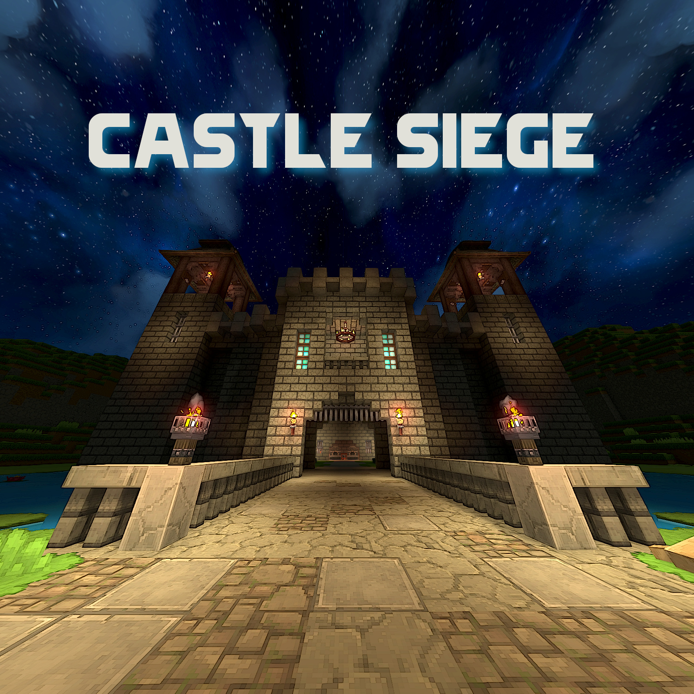
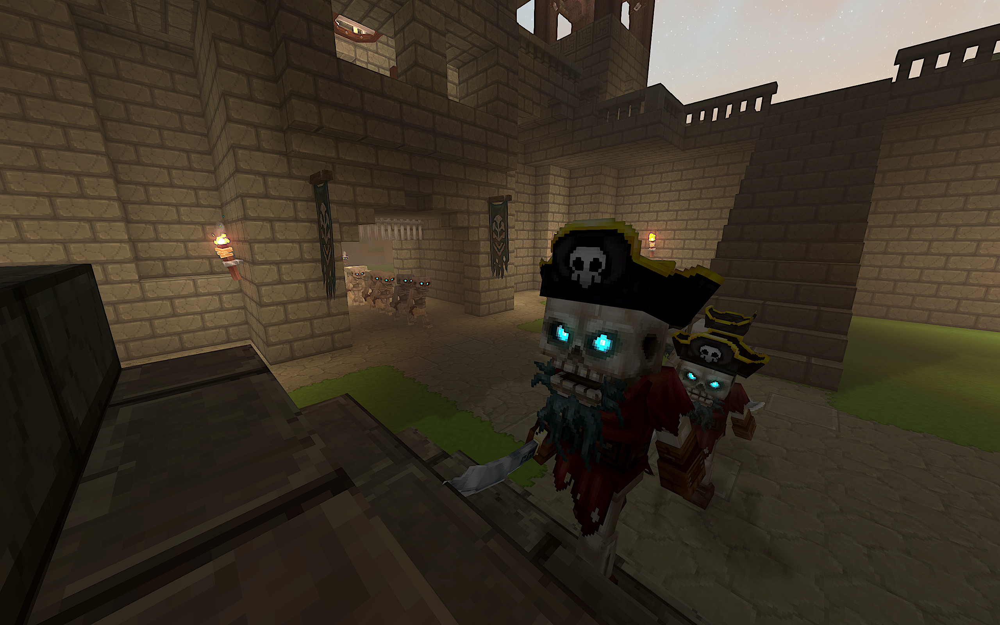
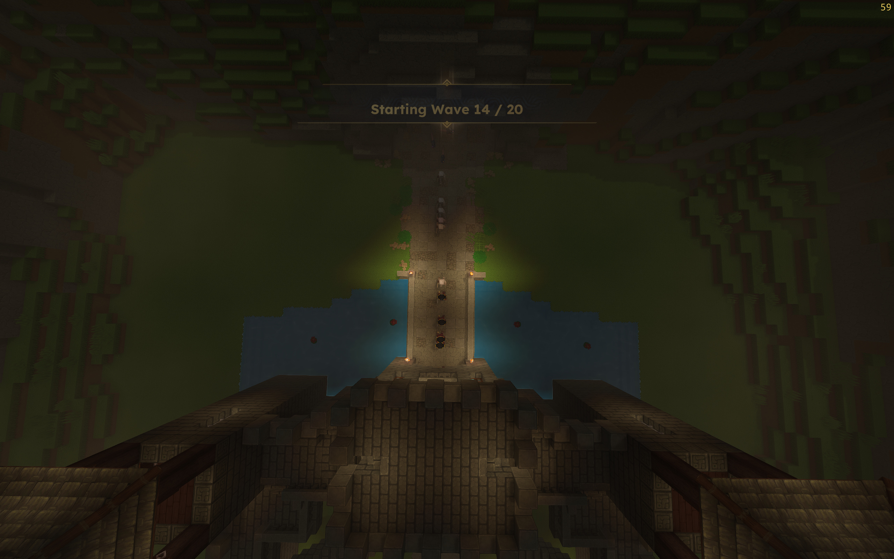
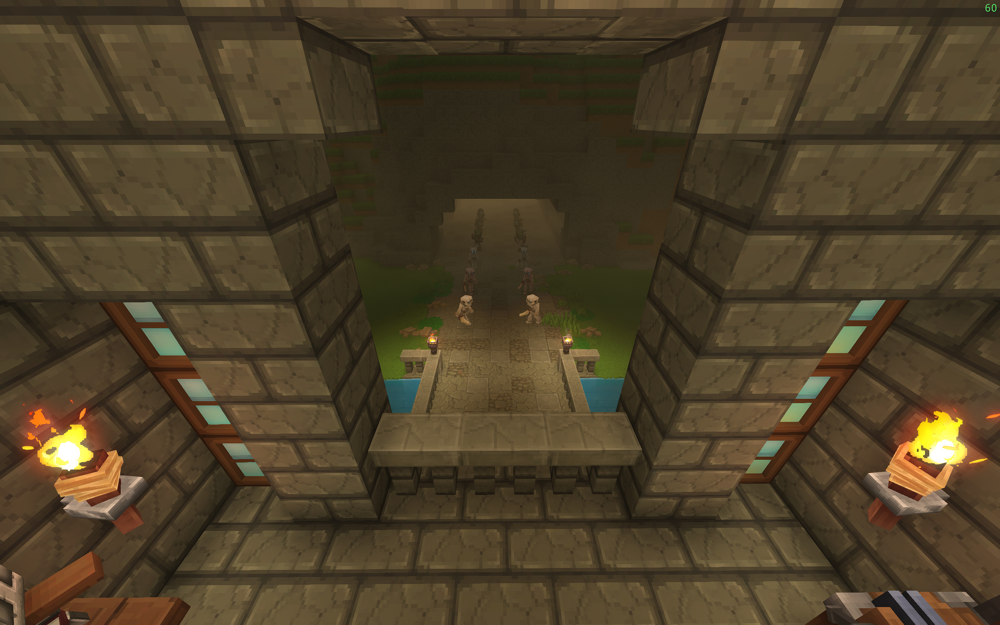

## Hytale Castle Siege Minigame

Castle Siege is a cooperative tower-defense inspired minigame for Hytale. Defend your castle against 20 waves of increasingly difficult mobs. 
Play it solo or with your friends. **[Download it here](https://legacy.curseforge.com/hytale/worlds/castle-siege)**

  
  
  
  

### How It Works
Run Castle Siege locally or on a server. At spawn, you receive a custom game tool "hammer" - right-click it to open the minigame UI and start the first wave. Enemies march in formation - utilizing Hytale's prefab AI path hints - forcing players to choose their strategy carefully. Clear every mob in a wave to advance to the next one.

### Features
- **20 hand-crafted waves** - Progressively difficult mob formations.
- **10+ custom mobs** - Enhanced AI and combat abilities designed for castle warfare.
- **Unique rewards** - Earn materials (wood, ore, health potions, etc) to craft and gear up the next wave.
- **Co-op multiplayer** - All players fight together (pvp disabled by default). Per-player stats and team stats are tracked.

### Getting Started
1. Simply add the included world to your Hytale saves directory (or your server directory).

   _The mod (.jar) file is included in the world `mods` directory._

    **Easiest way:**
        Open the game launcher, go to **settings** (the gear icon next to the play button), and click "open directory" to find the UserData\Saves folder. 

    **Key Locations:**
   - Windows: `%appdata%\Hytale\UserData\Saves\`
   - Linux: `~/.var/app/com.hypixel.HytaleLauncher/data/Hytale/UserData/Saves/`
   - macOS: `~/Library/Application Support/Hytale/UserData/Saves/`

   Add the Castle Siege world there.

2. Start/join the included world, and you will be given a crude ax and a Castle Siege game tool "hammer"
3. Right click while holding the Castle Siege "hammer" to open the Wave UI and start Wave 1.
4. Fight!

### Commands
The game includes the following in-game commands:

- `/cs <action>` - Castle Siege control command. Available to all players. Actions:
  - `reset --confirm` - Resets the wave counter to 0, despawns all wave NPCs, teleports every player to spawn, and replaces their inventory with just the Wave Hammer and a Crude Axe. Run without `--confirm` first to see a summary.
  - `ui` - Opens the Wave UI page (same as right-clicking the Castle Siege hammer).
  - `hud` - Toggles the Wave HUD overlay on/off.
  - `wave --wave <n>` - Jumps to and starts wave `n` (1–20).
  - `next` - Starts the next wave.
  - `debugmobs` - Prints per-wave mob counts and DPS estimates to chat and the server log.

Use `/cs reset --confirm` to prepare the world. Your items will be replaced with the bare basics: a crude ax and a Castle Siege game tool "hammer".

## For Developers
Castle Siege use the **[Hytale Modding plugin template](https://github.com/HytaleModding/plugin-template)** so give check them out and give them lots of support!

See their complete getting started guide [here](https://hytalemodding.dev/en/docs/guides/plugin/setting-up-env#setting-up-your-workspace)

**Basic steps to get up and running:**
1. [Configure or Install the Java SDK](https://hytalemodding.dev/en/docs/guides/plugin/setting-up-env)
   to use the latest 25 from JetBrains or similar.
2. Open the project in your favorite IDE, we
   recommend [IntelliJ IDEA](https://www.jetbrains.com/idea/download).
3. Optionally, run `./gradlew` if your IDE does not automatically synchronize.
4. Run the `devserver` with the Run Configuration created, or `./gradlew devServer`.

> On Windows, use `.\gradlew.bat` instead of `./gradlew`, this script is here to run the
> Gradle without you needing to install the tooling itself, only the Java is required.

With that you will be prompted in the output to authorize your server, and then you can start
developing your plugin while the server is live reloading the code changes.

### Scaffoldit Plugin

While there are multiple plugins made for Hytale, the template currently uses a zero-boilerplate one
where you only need the absolute minimum to start. However, you do have access to everything as
normal if you know what you are doing.

For in-depth configuration, you can visit the [ScaffoldIt Plugin Docs](https://scaffoldit.dev).

### Troubleshooting

- **Gradle sync fails in IntelliJ** –
  _Check that Java 25 is installed and configured under File → Project Structure → SDKs._
- **Build fails with missing dependencies** –
  _Run `./gradlew build --refresh-dependencies`. Make sure you have internet access!_
- **Permission denied on `./gradlew`** –
  _Run `chmod +x gradlew` (macOS/Linux)._
- **Hot-reload doesn't work** –
  _Verify you're using JetBrains Runtime, not a regular JDK._

## Additional Resources

### General
- [Hytale Modding Guides](https://hytalemodding.dev)
- [Hytale Modding Discord](https://discord.gg/hytalemodding)
- [ScaffoldIt Plugin Docs](https://scaffoldit.dev)
- [Hytale Modding Guide by Britakee Studios](https://britakee-studios.gitbook.io/hytale-modding-documentation)

#### Player Interaction
- https://www.youtube.com/watch?v=SITX2Mgdqqc
- [Interactive Items Example Source by OwnerAli](https://github.com/OwnerAli/Hytale-Template/tree/feature/interactive)

#### NPCs
- https://hytale.com/news/2026/2/npc-technical-rundown
- https://hytalemodding.dev/en/docs/official-documentation/npc/9-inter-npc-interaction
- https://hytale.game/en/mastering-npc-commands/

## Credits
- [MTN Hytale font by Martin Costa](https://fontstruct.com/fontstructions/download/2828592)

## License
MIT

